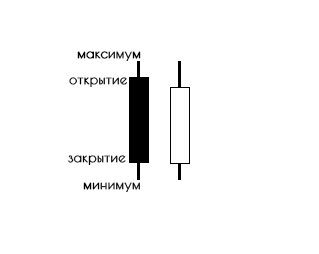

# Домашнее задание №3

## Что нужно сделать
Необходимо реализовать пайплайн обработки цен и формирования свечей.
Пайплан должен состоять из следующих этапов:
- Из входного потока цен формировать 1-минутные свечи.
- Из потока 1-минутных свечей формировать 2х-минутные свечи.
- Из потока 2х-минутных свечей формировать 10-минутные свечи.
- Сохранять в файл `candles_{%period}.csv` свечи для всех периодов (всего 3 файла).

Программа должна завершаться после того, как получит сигнал `SIGINT` (Ctrl+C).
Важно, чтобы пайплайн завершил обрабатывать "текущую" цену (уже сгенерированную и отправленную в входной канал) и успеть всё сохранить, перед тем, как программа завершится.

**Решение принимается только если код проходит lint - `make lint` (нужен докер).**
## Дано (domain/common.go)

### Prices

Функция `Prices(ctx context)` генерирует случайные объекты типа `Price` и отправляет его в канал (точка входа вашего пайплайна).
```go
type Price struct {
	Ticker string
	Value  float64
	TS     time.Time
}
```
Цены отправляются в канал `prices` с последовательными таймстемпами (`TS`).
Пример данных, отправляемых в канал:
```
price 0: {Ticker:AAPL Value:112.0932057595924 TS:2021-09-09 13:22:14 +0300 MSK} 
price 1: {Ticker:SBER Value:218.81018176090026 TS:2021-09-09 13:22:14 +0300 MSK} 
price 2: {Ticker:NVDA Value:313.29120106436983 TS:2021-09-09 13:22:14 +0300 MSK} 
price 3: {Ticker:TSLA Value:408.7542837437396 TS:2021-09-09 13:22:14 +0300 MSK} 
price 4: {Ticker:AAPL Value:108.49274994142532 TS:2021-09-09 13:22:14 +0300 MSK} 
price 5: {Ticker:SBER Value:213.7364614573422 TS:2021-09-09 13:22:14 +0300 MSK} 
price 6: {Ticker:NVDA Value:301.3127403843495 TS:2021-09-09 13:22:14 +0300 MSK} 
price 7: {Ticker:TSLA Value:403.1303850946558 TS:2021-09-09 13:22:14 +0300 MSK} 
price 8: {Ticker:AAPL Value:101.93939037828969 TS:2021-09-09 13:22:25 +0300 MSK} 
price 9: {Ticker:SBER Value:206.01823721170575 TS:2021-09-09 13:22:25 +0300 MSK} 
price 10: {Ticker:NVDA Value:310.3042525700413 TS:2021-09-09 13:22:25 +0300 MSK}
```

### Candles
Структура свечей, которые нужно формировать из цен и свечей более низкого порядка.
```go
type Candle struct {
    Ticker string
    Period CandlePeriod // Интервал
    Open   float64      // Цена открытия
    High   float64      // Максимальная цена
    Low    float64      // Минимальная цена
    Close  float64      // Цена закрытие
    TS     time.Time    // Время начала интервала
}
```



### Period

Тип для свечного периода и функция `PeriodTS`, которая округляет время до начала периода.

Например, у нас есть время `13:23:14`.
Для 1-минутной свечи, это время входит в промежуток `13:23:00 - 13:23:59`, и `PeriodTS('1m', '13:23:14')` вернёт `13:23:00`.
Для 2х-минутной свечи - `13:22:00`. Для 10-минутной свечи - `13:20:00`.


```go
var ErrUnknownPeriod = errors.New("unknown period")

type CandlePeriod string

const (
	CandlePeriod1m  CandlePeriod = "1m"
	CandlePeriod2m  CandlePeriod = "2m"
	CandlePeriod10m CandlePeriod = "10m"
)

func PeriodTS(period CandlePeriod, ts time.Time) (time.Time, error) {
    switch period {
    case CandlePeriod1m:
        return ts.Truncate(time.Minute), nil
    case CandlePeriod2m:
        return ts.Truncate(2 * time.Minute), nil
    case CandlePeriod10m:
        return ts.Truncate(10 * time.Minute), nil
    default:
        return time.Time{}, ErrUnknownPeriod
    }
}
```

### Пример выходного файла 

candles_1m.csv

```
AAPL,2021-09-06T16:07:00+03:00,112.093206,112.093206,101.939390,104.285277
SBER,2021-09-06T16:07:00+03:00,218.810182,218.810182,206.018237,207.613144
NVDA,2021-09-06T16:07:00+03:00,313.291201,313.291201,301.312740,306.361163
TSLA,2021-09-06T16:07:00+03:00,408.754284,416.272799,403.130385,409.377797
AAPL,2021-09-06T16:08:00+03:00,105.660683,117.887235,103.166566,117.887235
SBER,2021-09-06T16:08:00+03:00,205.862037,213.934383,201.182413,201.949092
NVDA,2021-09-06T16:08:00+03:00,313.581694,319.538337,305.070810,319.538337
TSLA,2021-09-06T16:08:00+03:00,404.371061,417.249829,400.566062,401.485820
AAPL,2021-09-06T16:09:00+03:00,104.445788,119.578587,101.710410,108.698249
SBER,2021-09-06T16:09:00+03:00,213.621566,219.098909,202.535059,212.501901
```